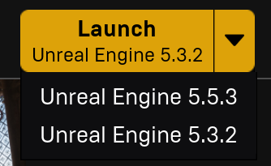
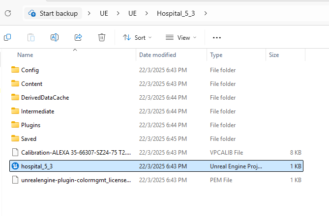
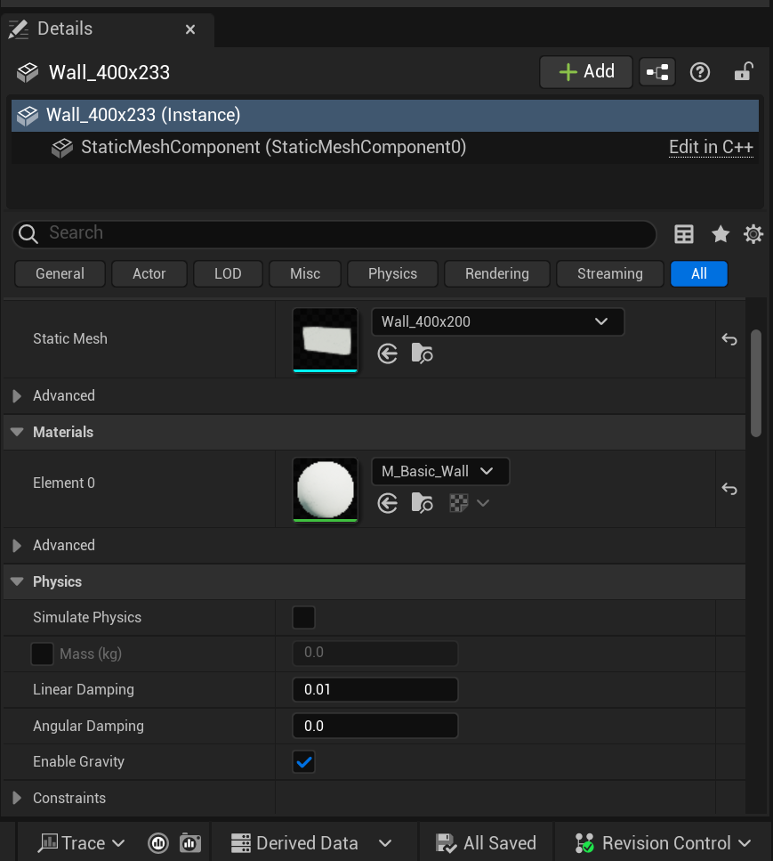

# User Manual for Virtual Environment assets

## 1. Introduction
Welcome to the Virtual Environment assets for Unreal Engine 5.3. This assets provides a high-quality, immersive environment for virtual production. It includes two distinct areas:
- **Hospital Room** (interactive elements available)
- **Monitoring Room**
- **Corridor**

This manual will guide you through installation, navigation, material customization, and interaction.

---

## 2. Installation & Setup
### **Step 1: Install Unreal Engine 5.3**
1. Download and install **Epic Games Launcher** from [Epic Games](https://www.unrealengine.com/).
2. Open the launcher and navigate to **Unreal Engine**.
3. Click **Install** and select version **5.3.2**.
4. Launch **Unreal Engine 5.3.2**.

### **Step 2: Open the Virtual Environment**

1. Open the folder, locate and double-click the file with Unreal Engine icon – Unreal Engine will launch and load the environment. You may want to open the *Hospital* project first, on which we focused most of our efforts.

2. Press the green triangle button on top of the bar to run the environment.

---

## 3. Navigating the Scene
Use the following controls to move around:
- **W, A, S, D** – Move forward, left, backward, right
- **Mouse Movement** – Look around
- **Right Mouse Button (Hold)** – Enable freelook mode
- **Spacebar** – Move up
- **Left Ctrl** – Move down
- **Shift (Hold)** – Increase movement speed

---

## 4. Interaction: Light Toggle (Hospital Room Only)
- Press **F** to toggle the lights in the hospital room.
- The action works only in the hospital room; other areas do not have interactive elements.

### assets before 

### assets after

---

## 5. Editing the assets
### **Step 1: Select the assets you want to edit**
1. Left-click on the assets you want to edit. Once selected, the assets will be highlighted as shown below.

### **Step 2: Changing material**
1. Locate the **Material** section in the **Details Panel** on the bottom right of the screen.
   
   
   
2. Click on the **dropdown menu** to select a different material.
    
    
    

### **Step 3: Changing Location**
1. After selecting the assets, a three-axis gizmo will appear.
   
   
   
2. Dragging the arrows moves the assets along different axes:
   - Red (X-Axis) -- Moves the object along the X-axis (Left / Right)
   - Green (Y-Axis) -- Moves the object along the Y-axis (Forward / Backward)
   - Blue (Z-Axis) -- Moves the object along the Z-axis (Up / Down)
---

## 6. License & Usage
The virtual assets is licensed under [CC BY 4.0](https://creativecommons.org/licenses/by/4.0/).

**You are free to:**
- Share — copy and redistribute the material in any medium or format for any purpose, even commercially.
- Adapt — remix, transform, and build upon the material for any purpose, even commercially.
The licensor cannot revoke these freedoms as long as you follow the license terms.

**Under the following terms:**
- Attribution — You must give appropriate credit , provide a link to the license, and indicate if changes were made . You may do so in any reasonable manner, but not in any way that suggests the licensor endorses you or your use.

Hope you enjoy our assets.
